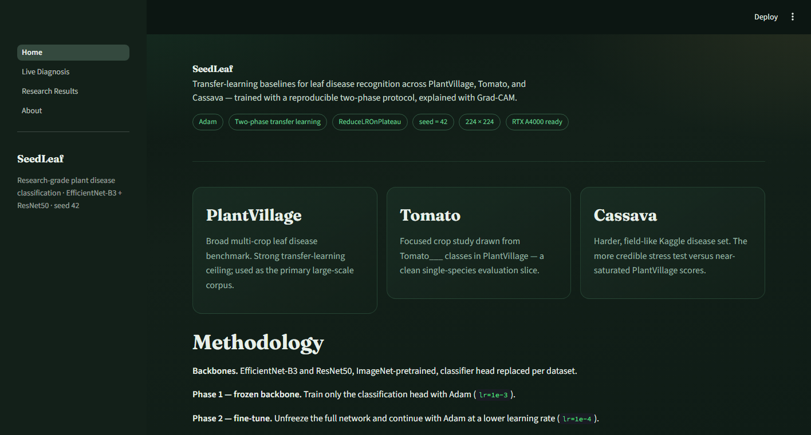
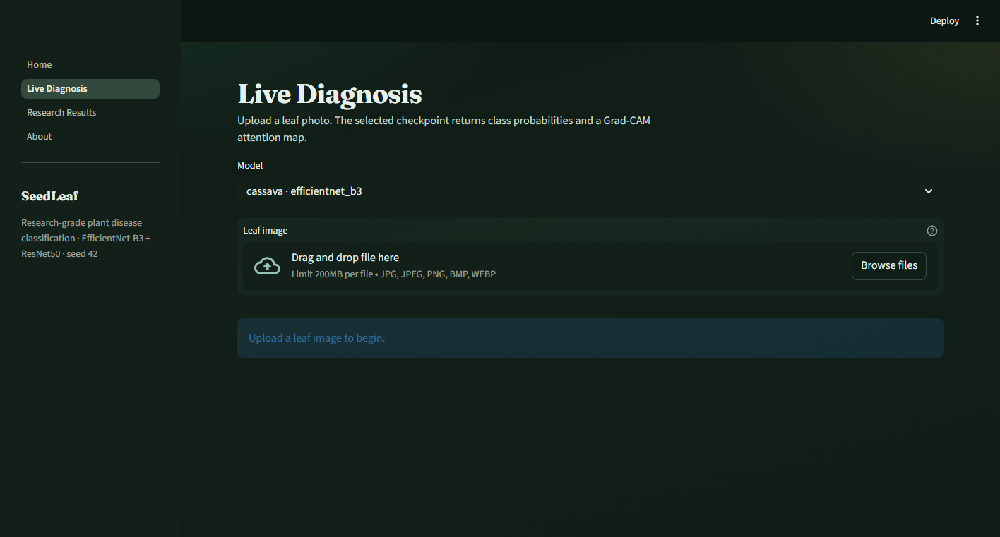
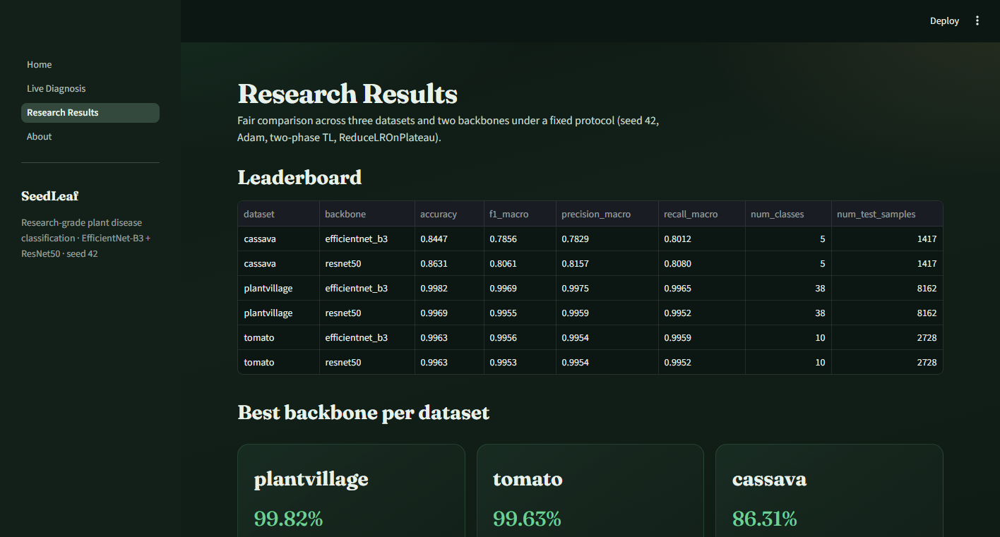

# SeedLeaf

**Research-grade plant leaf disease classification** with a reproducible two-phase transfer-learning protocol and a polished Streamlit demo.

[](https://www.python.org/)
[](https://pytorch.org/)
[](https://streamlit.io/)
[](LICENSE)

<p align="center">
  
</p>

---

## Highlights

| | |
|---|---|
| **Backbones** | EfficientNet-B3 · ResNet50 (ImageNet pretrained) |
| **Datasets** | PlantVillage · Tomato (PV subset) · Cassava |
| **Optimizer** | Adam |
| **Schedule** | ReduceLROnPlateau |
| **Protocol** | Two-phase transfer learning (freeze → fine-tune) |
| **Repro** | Global seed **42** · input **224×224** |
| **Hardware** | NVIDIA RTX A4000 (AMP) |
| **Explainability** | Grad-CAM overlays in Live Diagnosis |

This repo reports **strong reproducible baselines** — not absolute SOTA claims. PlantVillage scores are often near ceiling with modern CNNs; Cassava is the harder, more informative stress test.

---

## Live demo (screenshots)

### Home — methodology & dataset cards

<p align="center">
  
</p>

### Live Diagnosis — upload a leaf, get predictions + Grad-CAM

<p align="center">
  
</p>

### Research Results — paper-style leaderboard & curves

<p align="center">
  
</p>

```bash
streamlit run app/Home.py
```

---

## Results (seed 42)

| Dataset | Backbone | Accuracy | F1 (macro) |
|---------|----------|----------|------------|
| PlantVillage | EfficientNet-B3 | **99.82%** | 0.9969 |
| PlantVillage | ResNet50 | **99.69%** | 0.9955 |
| Tomato | EfficientNet-B3 | **99.63%** | 0.9956 |
| Tomato | ResNet50 | **99.63%** | 0.9953 |
| Cassava | EfficientNet-B3 | **84.47%** | 0.7856 |
| Cassava | ResNet50 | **86.31%** | 0.8061 |

Artifacts are written under `results/<dataset>__<backbone>/` (metrics JSON, confusion matrices, training curves). Checkpoints: `checkpoints/*_best.pt` (not committed — train locally or attach releases).

---

## Quick start

```bash
git clone https://github.com/ansulx/SeedLeaf.git
cd SeedLeaf
python -m venv .venv

# Windows
.venv\Scripts\activate
pip install -r requirements.txt

# Launch the Streamlit app (metrics already under results/)
streamlit run app/Home.py
```

For Live Diagnosis you need trained weights in `checkpoints/`. Train with the commands below (or download weights you host separately).

---

## Data preparation

```bash
python scripts/prepare_data.py --datasets plantvillage tomato cassava
```

| Dataset | Source |
|---------|--------|
| **PlantVillage** | Hugging Face `mohanty/PlantVillage` / `geraldmc/plantvillage-full` |
| **Tomato** | Filtered `Tomato___*` classes from PlantVillage |
| **Cassava** | HF `dpdl-benchmark/cassava` (Kaggle if credentials present) |

Processed layout:

```
data/<dataset>/{train,val,test}/<class_name>/*.jpg
```

Optional: Kaggle API (`~/.kaggle/kaggle.json`) and/or `HF_TOKEN` for gated mirrors.

---

## Training (RTX A4000)

Config: [`configs/default.yaml`](configs/default.yaml)

| Phase | Behavior | LR | Epochs |
|-------|----------|----|--------|
| 1 | Freeze backbone, train head | `1e-3` | 8 |
| 2 | Unfreeze, fine-tune | `1e-4` | 20 |

```bash
# Single run
python scripts/train_one.py --dataset tomato --backbone efficientnet_b3

# Full 3×2 grid
python scripts/train_all.py

# Skip finished (non-demo) runs
python scripts/train_all.py --skip-existing
```

---

## Project layout

```
SeedLeaf/
  configs/default.yaml
  src/
    data/       # download, splits, transforms
    models/     # EfficientNet-B3, ResNet50
    train/      # seed utils, two-phase trainer
    eval/       # metrics + plots
    explain/    # Grad-CAM
  scripts/      # prepare / train / evaluate / screenshots
  app/          # Streamlit multipage UI
  docs/screenshots/
  results/      # published metrics & figures
  checkpoints/  # local *.pt (gitignored)
```

---

## Methodology notes

1. Fixed seed **42** across Python, NumPy, and PyTorch.
2. Images resized to **224×224** with ImageNet mean/std; light augmentation on train only.
3. **Adam** + weight decay `1e-4`.
4. **ReduceLROnPlateau** on validation loss (factor 0.5, patience 3).
5. Two-phase transfer learning: classifier head → full-network fine-tune.
6. Metrics: accuracy, macro precision/recall/F1, confusion matrix, curves.
7. Grad-CAM on the late convolutional stage of each backbone.

---

## License & data

Code is MIT (see [LICENSE](LICENSE)). Dataset licenses remain with their original publishers (PlantVillage, Hugging Face / Kaggle mirrors). Respect those terms when redistributing images or weights.

---

<p align="center"><sub>Built for reproducible plant-disease research demos · EfficientNet-B3 + ResNet50 · seed 42</sub></p>
